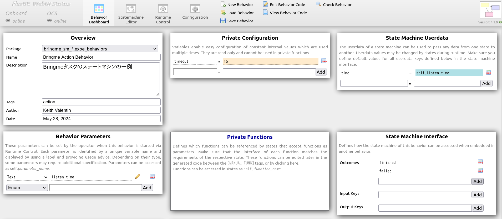
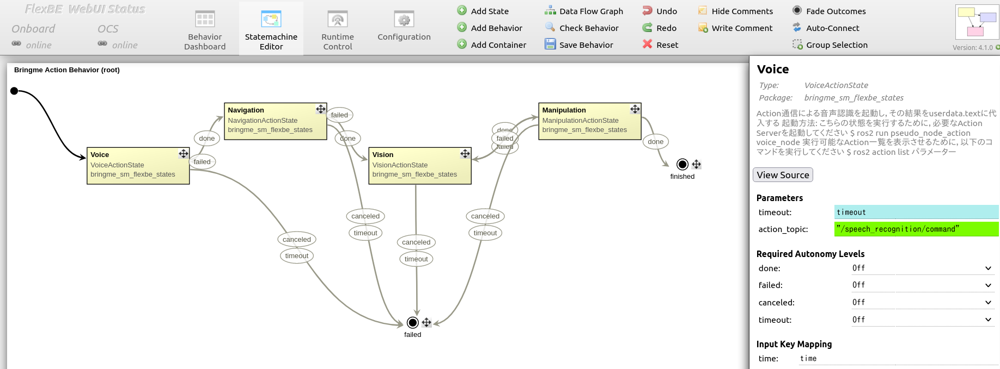
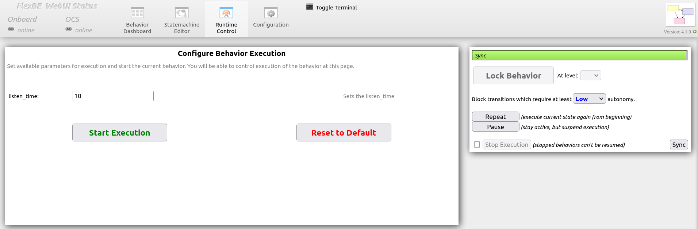

## 第７章の解答例

こちらのパッケージには第７章に挙げられたチャレンジを解答します．

> [!IMPORTANT]
> `bringme_sm_advanced_smach`というパッケージはサポートしません．
そちらのソースコードについては，[AI Robot Book 各章の解答例](https://github.com/AI-Robot-Book/answers/tree/master/chapter7)の方にIssueを立ててください．


### チャレンジ７.１

チャレンジ７.１ではVoice状態から接続する音声の疑似ノードを第3章で作成した音声認識に置き換えるステートマシンが動作するか確認するチャレンジを提案しました．

1. まず，[bringme_action_behavior_sm.py](https://github.com/AI-Robot-Book-Humble/chapter7/blob/master/bringme_sm_flexbe/bringme_sm_flexbe_behaviors/bringme_sm_flexbe_behaviors/bringme_action_behavior_sm.py)という元のステートマシンを[challenge_7_1_bringme_action_behavior_sm.py](bringme_sm_advanced_flexbe/challenge_7_1_bringme_action_behavior_sm.py)に書き換えてください．

    こちらでは，[95行目](https://github.com/AI-Robot-Book-Humble/chapter7/blob/7199739f0d2d78ba27b64cb359059d87bbe964bd/bringme_sm_flexbe/bringme_sm_flexbe_behaviors/bringme_sm_flexbe_behaviors/bringme_action_behavior_sm.py#L95)に書かれている音声認識を行うノードの名前を`/speech_recognition`に書き変えます．

更新前: [95行目](https://github.com/AI-Robot-Book-Humble/chapter7/blob/7199739f0d2d78ba27b64cb359059d87bbe964bd/bringme_sm_flexbe/bringme_sm_flexbe_behaviors/bringme_sm_flexbe_behaviors/bringme_action_behavior_sm.py#L95)
```python
VoiceActionState(timeout=timeout, action_topic="ps_voice/command"),
```

更新後: [95行目](https://github.com/AI-Robot-Book-Humble/answers/blob/c244fbf2d38711397f5a8fe29374c8f3b9d6df4a/chapter7/bringme_sm_advanced_flexbe/challenge_7_1_bringme_action_behavior_sm.py#L95)
```python
VoiceActionState(timeout=timeout, action_topic="/speech_recognition/command"),
```

2. 次に，元の音声の疑似ノードである[voice_action_state.py](https://github.com/AI-Robot-Book-Humble/chapter7/blob/master/bringme_sm_flexbe/bringme_sm_flexbe_states/bringme_sm_flexbe_states/voice_action_state.py)を[challenge_7_1_voice_action_state.py](bringme_sm_advanced_flexbe/challenge_7_1_voice_action_state.py)に書き換えてください．

    こちらでは，複雑な言語処理は行わないのですが，音声認識から取得した音声データから`cup`という対象物と`kitchen`という対象場所が含まれているかどうかを確認します．
    もし，どちらか文章には含まれていなければ，状態は失敗し，もう一度音声を聞きます．

更新前: [行99目](https://github.com/AI-Robot-Book-Humble/chapter7/blob/7199739f0d2d78ba27b64cb359059d87bbe964bd/bringme_sm_flexbe/bringme_sm_flexbe_states/bringme_sm_flexbe_states/voice_action_state.py#L99)-[行104目](https://github.com/AI-Robot-Book-Humble/chapter7/blob/7199739f0d2d78ba27b64cb359059d87bbe964bd/bringme_sm_flexbe/bringme_sm_flexbe_states/bringme_sm_flexbe_states/voice_action_state.py#L104)
```python
# 音声認識の結果を処理する必要があります
userdata.target      = 'cup'
userdata.destination = 'kitchen'

self._return = 'done'
return self._return # 'done'という結果を返します
```

更新後: [行99目](https://github.com/AI-Robot-Book-Humble/answers/blob/30f87e0f67b5c0aefda3509923b89f8e637ee831/chapter7/bringme_sm_advanced_flexbe/challenge_7_1_voice_action_state.py#L99)-[行111目](https://github.com/AI-Robot-Book-Humble/answers/blob/30f87e0f67b5c0aefda3509923b89f8e637ee831/chapter7/bringme_sm_advanced_flexbe/challenge_7_1_voice_action_state.py#L111)
```python
# 音声認識の結果を処理する必要があります
# 今回は，カップとキッチンの単語が含まれているかを確認します
userdata.target      = 'cup' if 'cup' in userdata.text else ''
userdata.destination = 'kitchen' if 'kitchen' in userdata.text else ''
# Challenge3.1にご参照ください．
# userdata.target, userdata.destination = search_object_and_place(userdata.text)

if len(userdata.target) > 0 and len(userdata.destination) > 0:    
    self._return = 'done' # 'done'という結果を設定します
else:        
    self._return = 'failed' # 'failed'という結果を設定します

return self._return # 'done'または'failed'という結果を返します
```

> [!NOTE]
> より賢い自然言語処理に対応するために`search_object_and_place()`という関数を利用する場合は，[challenge_3_1.py](../chapter3/)に参照してください．

3. プログラムを修正した後，パッケージをコンパイルし，読み込みしましょう．
```bash
cd ~/ai_robot_ws
colcon build
sourcce install/setup.bash
``` 

4. また，音声認識とその他の疑似ノードを立ち上げます．
```bash
ros2 launch ~/airobot_ws/src/answers/chapter7/bringme_sm_advanced_flexbe challenge_7_1_bringme_nodes.launch.py
```
> [!NOTE]
> このラウンチファイルでは，`chapter3`の[speech_recognition_server.py](https://github.com/AI-Robot-Book-Humble/chapter3/blob/master/speech_action/speech_action/speech_recognition_server.py)を実行します．

5. 別の端末でFlexBe WebUIを立ち上げて，`Bringme Action Behavior`というステートマシンを選択してください．
```bash
ros2 launch flexbe_webui flexbe_full.launch.py
```


6. FlexBe WebIUのState Machine Editorの中にある`Voice`状態のパラメータを確認して，`action_topic`には`"/speech_recognition/command"`と書かれているか確かめてください．



7. 最後に，FlexBe WebIUのRuntime Controlへ移動して，`listen_time`で聴音時間を設定して，`Start Execution`．


> [!NOTE]
> デフォルトの聴音時間は`10`秒となっております．


## ディレクトリ構成

- **[bringme_sm_advanced_flexbe](bringme_sm_advanced_flexbe):** Bring meタスクのステートマシンのチャレンジプログラム (FlexBE版)
- **[(アーカイブ) bringme_sm_advanced_smach](bringme_sm_advanced_smach):** Bring meタスクのステートマシンのチャレンジプログラム (Smach版)
